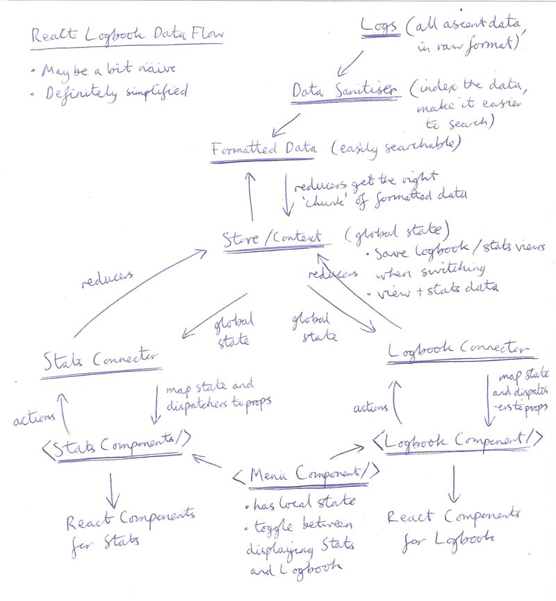

# Climbing Logbook :mount_fuji:
> [View here (on Github Pages)](https://martinbagshaw.github.io/ReactLogbook/)

An SPA (Single Page Application) implementation of my climbing logbook, taken from [UKClimbing.com](https://www.ukclimbing.com/logbook/showlog.php?id=152526). A new and improved version of a [much more naive version](https://github.com/martinbagshaw/climbing-logbook), which I made in plain old HTML, CSS, and JavaScript.

## Setup
1. Clone the repo
2. `npm install`
3. `npm run dev` to run in development mode. View at [http://localhost:1234/](http://localhost:1234/)
4. `npm t` to run tests with jest and react testing library

### Stack :books:

| **Category**           | **Technology**                                                                            |
|------------------------|-------------------------------------------------------------------------------------------|
| Languages              | TypeScript, HTML, CSS                                                                     |
| Frameworks & Libraries | React, React DOM, React Router DOM, Styled Components, D3                                 |
| Bundler                | Parcel                                                                                    |
| Quality Assurance      | Es-lint, Prettier                                                                         |

### New things for this project :hatching_chick:
- React Hooks
- D3 - data visualisation library
- TypeScript

### UI Mockups
> Drafts of the UI - something resembling how the finished product may look

[...The Figma Mockup can be found here](https://www.figma.com/file/fErHEaT4Gk2u3kCLaTTOsjay/React-Logbook)

### Data Flow
> Flow of data through the app - how data, state, and components may interact

> **Disclaimer:** somewhat naive at the moment, probably

### Todo List :heavy_check_mark:
> A non- exhaustive, and regularly iterated on todo list can be [found here on HackMD](https://hackmd.io/Y3lQWBxjRQio8KjlLFEZaw)

> Will include trials and tribulations, and notes to help me along the way