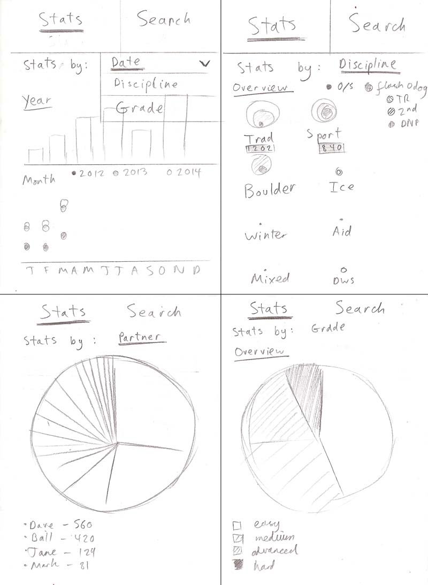

# Climbing Logbook

An SPA (Single Page Application) implementation of my climbing logbook, taken from [UKClimbing.com](https://www.ukclimbing.com/logbook/showlog.php?id=152526). A new and improved version of a [much more naive version](https://github.com/mr-bagglesworth/climbing-logbook), which I made in plain old HTML, CSS, and JavaScript.

## Setup
1. Clone the repo
2. `npm install`
3. `npm run dev` to run in development mode. View at [http://localhost:1234/](http://localhost:1234/)
4. `npm t` to run tests with jest and react testing library

### Mockup
> A draft of user flow through the app, and a rudimentary UI

### Stack
> Things I intend to use

| **Category**           | **Technology**                                                                            |
|------------------------|-------------------------------------------------------------------------------------------|
| Languages              | JavaScript, HTML, CSS                                                                     |
| Frameworks & Libraries | React, React DOM, React Router DOM, Styled Components, D3                                 |
| Testing                | Jest, React Testing Library                                                               |
| Dev Tools / Other      | Parcel, Github                                                                            |
| Quality Assurance      | Es-lint, Prettier                                                                         |

### New Things I intend to use (That I haven't used before April 2019)
- React Hooks
- D3
- MongoDB (perhaps). Alternative to localStorage

### Todo
1. Create a Mockup (above).
    - Previously a search engine.
    - To get cracking with D3 and Hooks, I could crunch some user data after it has loaded, and make charts from it
    - Start with an overview of the user's stats
2. Prioritise Hooks and D3

- Implement D3 for data visualisation
    - here is where the filtering comes in...
    - grouping user info would be nice to show, e.g...
        - average grade, grade groups
        - most climbed at crags
        - ascents by year / month / day
        - max grades
        - ascents by discipline

- A more efficient autocomplete (than currently implemented)
    - currently renders loads of html
    - could try a datalist
    - could show suggestions after minimum number of characters entered

- Save information on logs
    - favourite routes (star)
    - memorable routes (star + add note)
    - probably do this through localStorage, could try out MongoDB too

- Routing for logs
    - _will this add to the experience?_ Need more than date and route name, as same route can be climbed 2x in a day

- Tests
    - rendering on mount
    - rendering after interaction
    - routing
    - integration